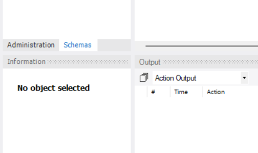
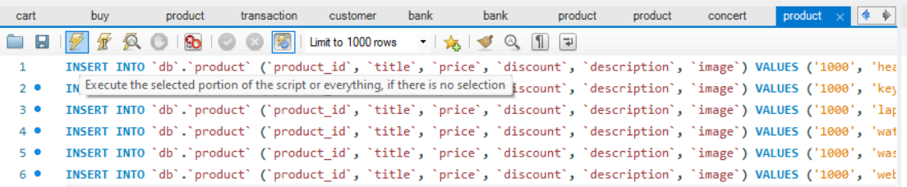
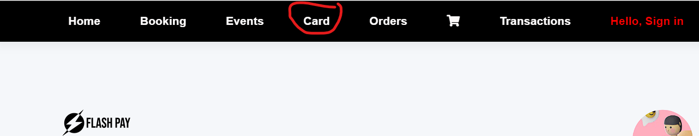

# Flash-Pay

## Requirements :

###                                 install vscode
###                                 install nodejs
###                                 install mysql      

----------------------------------------------------------------------------------------------------------------------

#### in mysql installation add mysql workbench and mysql connector along with the packages mentioned in the below video .
##### https://youtu.be/9cI9UgK3qZA?si=TIdc_W1uojFOeEz9
##### follow the video step by step to complete the setup
##### setup mysql passwords and all stuff
##### create a table 
-------------------------------------------------------------------------------------------------------------------------
### open the project folder in vscode 
 
#### step1: then click on the .env file in the folder , repalce it with your credentials  (you need to only change the db-name and password  , remaining all are same)

##### step2:   run the following commands in the terminal
#### step3:   To create node modules folder and to Download dependencies :  npm i
#### step4:   run the app : node app.js

----------------------------------------------------------------------------------------------------------------------------- 

#### open workbench , enter your credentials . Click on the schema button on bottom left 

#### click open the product table and click on the right most table button

#### select the products table and run the sql file (product.sql)
copy paste the content in the product table file

#### select the concert table and run the sql file (concert.sql)
#### copy paste the content in the concert table file
---------------------------------------------------------------------

#### again go to the terminal :
#### press ctrl+c
#### run the app : node app.js
#### click the link displayed in the terminal and  open the website .
-----------------------------------------------------------------------

#### now firstly you need to create a credit card to make the code work

#### on the navbar look for card button and click on it enter all details and your credit card will be saved 

#### add items to cart and checkout for payment .

------------------------------------------------------------------------------------------

#### OPTIONAL : further you could install nodemon and 
#### run the app : nodemon app.js
------------------------------------------------------------------------------------------------------------

#### to upload this project in cloud .. refer EBS (elastic bean stalk) and RDS cloud services on youtube  .
